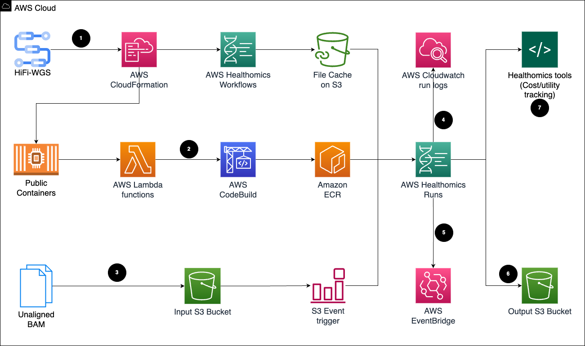

# PacBio Whole Genome Sequencing (WGS) Analysis with AWS HealthOmics Workflows

This repository contains resources for benchmarking and running PacBio Whole Genome Sequencing (WGS) variant pipeline analysis using AWS HealthOmics Workflows.

## Repository Structure

- **images/** - Contains architecture diagrams and other visual resources
  - `Pacbio_architecture.drawio.png` - Architecture diagram for the PacBio WGS pipeline

- **cloudformation/** - CloudFormation templates for infrastructure deployment
  - `pacbio-dockers-migration-cfn.yaml` - CloudFormation template for Docker container migration

- **healthomics-templates/** - Parameter templates for AWS HealthOmics workflows
  - `parameters-template.json` - Base parameter template
  - `parameters-a10g-values.json` - Parameters optimized for A10G instances
  - `parameters-default-cpu-values.json` - Default CPU-based parameters
  - `parameters-l4-values.json` - Parameters optimized for L4 GPU instances
  - `parameters-t4-values.json` - Parameters optimized for T4 GPU instances

- **HiFi-human-WGS-WDL.zip** - Workflow Definition Language (WDL) files for PacBio HiFi human WGS analysis can be cloned from https://github.com/PacificBiosciences/HiFi-human-WGS-WDL 

## Overview

This project demonstrates how to implement PacBio Whole Genome Sequencing (WGS) variant analysis pipelines using AWS HealthOmics Workflows. The repository includes CloudFormation templates for infrastructure setup, parameter templates for different compute environments, and workflow definitions.

## Architecture



## Getting Started

1. Review the architecture diagram to understand the workflow
2. Deploy the required infrastructure using the CloudFormation template in the `cloudformation` directory
3. Configure workflow parameters using the templates in the `healthomics-templates` directory
4. Extract and use the WDL workflows from `HiFi-human-WGS-WDL.zip`
5. Create workflow using parameters-template.json or just upload into healthomics workflow for auto creation of the template
````text

workflow_name="HiFi-human-WGS-WDL"
( cd ./${workflow_name} && zip -9 -r "${OLDPWD}/${workflow_name}.zip" . -x "./.git/*")

definition_uri=s3://apj-omics-us-s3/omics-workflows/${workflow_name}.zip
aws s3 cp HiFi-human-WGS-WDL.zip s3://apj-omics-us-s3/omics-workflows/

workflow_id=$(aws omics create-workflow \
    --engine WDL \
    --definition-uri s3://apj-omics-us-s3/omics-workflows/HiFi-human-WGS-WDL.zip \
    --name "Pacbio${workflow_name}-$(date +%Y%m%dT%H%M%SZ%z)" \
    --parameter-template file://${workflow_name}/fixed-parameters-template.json \
    --query 'id' \
    --output text \
    --main workflows/singleton.wdl \
    --profile useast1
)

aws omics wait workflow-active --id "${workflow_id}"
aws omics get-workflow --id "${workflow_id}" > "workflow-${workflow_name}.json"
```
6. Once AWS healthomics worklflow status become active in the workflow-${workflow_name}.json. Create workflow run using the following
```text
ACCOUNT_ID=$(aws sts get-caller-identity --output text --query "Account" )
# Modify the name of OmicsRole created by cloudformation template; it starts from <OmicsRole_...x
OMICS_WORKFLOW_ROLE_ARN="arn:aws:iam::${ACCOUNT_ID}:role/<OmicsRole_SOMETEXT>"
WORKFLOW_RUN_ID=$(aws omics start-run \
    --role-arn "${OMICS_WORKFLOW_ROLE_ARN}" \
    --workflow-id "$(jq -r '.id' workflow-${workflow_name}.json)" \
    --name "pacbioblog_gpua10g$(date +%Y%m%d-%H%M%S)" \
    --output-uri s3://<YOUR_BUCKET>/omics-output/HG002_omics-new-version \
    --parameters file://${workflow_name}/parameters-values.json \
    --query 'id' \
    --output text \
    --cache-id <YOUR_CACHE_ID> \ # CACHE_ID is optional if you don't want to cache workflow progress
    --cache-behavior CACHE_ON_FAILURE # you may skip when you don't want the cach-id
)
```
## Prerequisite for docker migration (onetime setup)

- Virtual Private Cloud (VPC) with two public subnets, VPC endpoints for S3 gateway, codebuild and cloudformation for lambda execution
- Create one Customer managed keys (CMK) in AWS Key Management Service (KMS) for the security compliance
- Create a secuity group to allow inbound traffic type 'https' and protocol 'tcp' with port range 443 source to be pointing self 
```text
# Create the security group and capture its ID
SECURITY_GROUP_ID=$(aws ec2 create-security-group \
    --group-name pacbio-https-sg \
    --description "Security group for HTTPS traffic - self-referencing" \
    --vpc-id vpc-xxxxxxxxx \
    --query 'GroupId' \
    --output text \
    --region <AWS_REGION>)

echo "Created Security Group: $SECURITY_GROUP_ID"

## Step 2: Add the Self-Referencing HTTPS Rule

bash
# Add inbound rule for HTTPS (port 443) from the security group itself
aws ec2 authorize-security-group-ingress \
    --group-id $SECURITY_GROUP_ID \
    --protocol tcp \
    --port 443 \
    --source-group $SECURITY_GROUP_ID \
    --region us-east-1
```

## Requirements

- AWS Account with access to HealthOmics service
- Appropriate IAM permissions
- PacBio WGS data

## References

For more details, refer to the PDF document: "Benchmarking PacBio Whole Genome Sequencing (WGS) Variant Pipeline Analysis with AWS HealthOmics Workflows.pdf"
